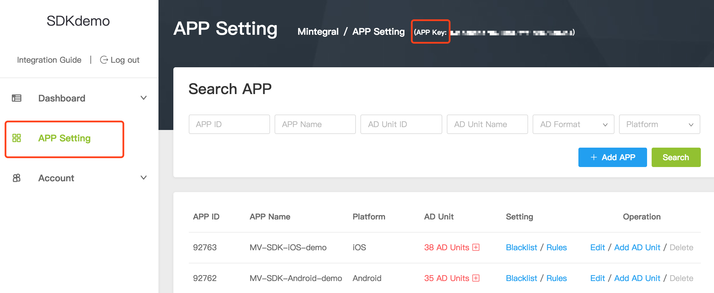

# Mediation Integration Guide (Android)
[Chinese Document](./docs/index_cn.md)

## Overview    

This document describes to Android developers how to aggregate other third-parties' ad SDK, through Mintegral. 
Currently, we only support aggregation of ironSource's Rewarded Video and Interstitial ad formats; ironSource's Interstitial ad corresponds to Mintegral's Interstitial Video.

## Mintegral Settings

### Retrieve account-related information

**APP Key**   
Each Mintegral account has a corresponding App Key, and the key will be needed for requesting ads. It can be retreived from your Mintegral account through the following path: **APP Setting -> App Key**:  


**App ID**   
The M-system will automatically generate a corresponding App ID for each app created by the developer. Find the App ID(s)  here: **APP Setting -> APP ID**:  


**Unit ID**  
The M-system will automatically generate a corresponding Unit ID for each ad space created by the developer. Find the Unit ID here: **Login to M-system —> App Setting—>  Ad Unit —> Ad Unit ID** :  


###  Obtain the SDK

[Click here ](http://cdn-adn.rayjump.com/cdn-adn/v2/portal/19/02/22/11/49/5c6f715dba0c6.zip) to download the latest version (9.8.0) of the Mintegral SDK for China.   

[Click here](http://cdn-adn.rayjump.com/cdn-adn/v2/portal/19/02/22/11/49/5c6f7156c5290.zip)  to download the latest version (9.8.0) of the Mintegral SDK.     

**Add the Mintegral SDK(s) to your project**`

**Integrate via JAR/AAR package**

#### Required Files for Interstitial 
mintegral_alphab.aar<br>
mintegral_common.aar/mintegral_chinacommon.aar<br>
mintegral_intersitialvideo.aar<br>
mintegral_videocommon.aar<br>
mintegral_videojs.aar<br>
mintegral_playercommon.aar<br>
mintegral_reward.aar<br>
mintegral_mtgjscommon.aar<br>
mintegral_mtgdownloads.aar<br>
or jar with their res file.

#### Required Files for Rewarded Video

mintegral_alphab.aar<br>
mintegral_common.aar/mintegral_chinacommon.aar<br>
mintegral_reward.aar<br> 
mintegral_videocommon.aar<br>
mintegral_videojs.aar<br>
mintegral_playercommon.aar<br>
mintegral_mtgjscommon.aar<br>
mintegral_mtgdownloads.aar<br>
or jar with their res file.


###  AndroidManifest.xml Configuration

1.Required permission 

**If you imported the  SDK for China-mainland , then you are required to get permission for the term "READ_PHONE_STATE". If your Android system is version 6.0 or above, you need to apply for the permission in your java code.**     

```java
    <uses-permission android:name="android.permission.INTERNET" />
    <uses-permission android:name="android.permission.WRITE_EXTERNAL_STORAGE"/>
    <uses-permission android:name="android.permission.ACCESS_NETWORK_STATE" />
    <uses-permission android:name="android.permission.REQUEST_INSTALL_PACKAGES"/>
    <!-- Required for the Mintegral SDK in China -->
    <uses-permission android:name="android.permission.READ_PHONE_STATE"/>
```

2.Optional permission

```java
    <uses-permission android:name="android.permission.ACCESS_WIFI_STATE" />
    <uses-permission android:name="android.permission.ACCESS_COARSE_LOCATION" />
    <uses-permission android:name="android.permission.ACCESS_FINE_LOCATION" />
```

3.Component

```xml
    <activity
	android:name="com.mintegral.msdk.activity.MTGCommonActivity"
	android:configChanges="keyboard|orientation"
	android:screenOrientation="portrait"
	android:exported="true"
	android:theme="@android:style/Theme.Translucent.NoTitleBar">
    </activity>
    
        <activity
            android:name="com.mintegral.msdk.reward.player.MTGRewardVideoActivity"
            android:configChanges="orientation|keyboardHidden|screenSize"
            android:theme="@android:style/Theme.NoTitleBar.Fullscreen" />

    <receiver android:name="com.mintegral.msdk.click.AppReceiver" >
        <intent-filter>
            <action android:name="android.intent.action.PACKAGE_ADDED" />
            <data android:scheme="package" />
        </intent-filter>
    </receiver>
    <service android:name="com.mintegral.msdk.shell.MTGService" >
        <intent-filter>
            <action android:name="com.mintegral.msdk.download.action" />
        </intent-filter>
    </service>
```


4.Downloader adaptation   

(1) **Update the Android Support v4 to 26.0.0 or above.**

(2) **Adapt the FileProvider if the targetSDKVersion >= 24.**   
Add these codes in mtg_provider_paths.xml

```xml
	<?xml version="1.0" encoding="utf-8"?>
	<paths xmlns:android="http://schemas.android.com/apk/res/android">
	 <external-path name="external_files" path="."/>
	</paths>
```
Add these codes in AndroidManifest.xml

```xml
	<provider
            android:name="com.mintegral.msdk.base.utils.MTGFileProvider"
            android:authorities="${applicationId}.mtgFileProvider"
            android:exported="false"
            android:grantUriPermissions="true">
            <meta-data
                android:name="android.support.FILE_PROVIDER_PATHS"
                android:resource="@xml/mtg_provider_paths"/>
        </provider>
```

5.Hardware acceleration      
Add these codes "android:hardwareAccelerated=ture" in application tab：

```java
<application
        ...
        android:hardwareAccelerated="true">
        ...
        ...
        ...
        ...

</application>
```

6.Code obfuscation configuration

```java
    -keepattributes Signature   
    -keepattributes *Annotation*   
    -keep class com.mintegral.** {*; }  
    -keep interface com.mintegral.** {*; }  
    -keep class android.support.v4.** { *; }  
    -dontwarn com.mintegral.**   
    -keep class **.R$* { public static final int mintegral*; }
    -keep class com.alphab.** {*; }
    -keep interface com.alphab.** {*; }
```

7.Android 9.0 compatibility considerations  

**Currently, the Android SDK does not support Android 9.0 or above. If the app crashes under Android 9.0 or above, you can choose one of the two solutions below.**

(1) Add these codes in AndroidManifest.xml:  

```xml
<uses-library android:name="org.apache.http.legacy" android:required="false"/>
```
(2)Set the targaetSDKveriosn to 27 or below.    


## ironSource Settings

### Create your account
#### [Sign up](https://platform.ironsrc.com/partners/signup)and[sign in](https://platform.ironsrc.com/partners/tour)to your ironSource account.     
#### Create new app 
To add your application to the ironSource dashboard, click the **New App** button.


### Enter app details

Select **Mobile App**, enter the **Google Play URL** of your app, and click **Import App Info**. Once your app information is displayed, click the **Add App** button.

If your app is not available, select **App Not Live in the Application Store** and provide a **Temporary Name** for your app. Select Android as **platform** and click **Add App**.


#### Unit Setting
Take note of your new **App Key**, This value will be used when loading ads. Select the ad formats your app supports in the appropriate tabs. Then click **Done**.


### Integrating ironSource 
reference link: [ironsource Integration Guide](https://developers.ironsrc.com/ironsource-mobile/android/android-sdk/)

#### Import ironSource SDK

Add the following ironSource Maven repository and implementation dependency with the latest version of the ironSource SDK and adapter in the app-level build.gradle file:

```java
repositories {
    maven {
        url "https://dl.bintray.com/ironsource-mobile/android-sdk"
   }
}    
 

dependencies {
implementation 'com.ironsource.sdk:mediationsdk:6.8.1@jar' 

}
```
#### Modify Android Manifest 

```java
 <activity
            android:name="com.ironsource.sdk.controller.ControllerActivity"
            android:configChanges="orientation|screenSize"
            android:hardwareAccelerated="true" />
        <activity
            android:name="com.ironsource.sdk.controller.InterstitialActivity"
            android:configChanges="orientation|screenSize"
            android:hardwareAccelerated="true"
            android:theme="@android:style/Theme.Translucent" />
        <activity
            android:name="com.ironsource.sdk.controller.OpenUrlActivity"
            android:configChanges="orientation|screenSize"
            android:hardwareAccelerated="true"
            android:theme="@android:style/Theme.Translucent" 
/>
```
#### Code Obfuscation Configuration

```java
-keepclassmembers class com.ironsource.sdk.controller.IronSourceWebView$JSInterface {
    public *;
}
-keepclassmembers class * implements android.os.Parcelable {
    public static final android.os.Parcelable$Creator *;
}
-keep public class com.google.android.gms.ads.** {
   public *;
}
-keep class com.ironsource.adapters.** { *;
}
-dontwarn com.ironsource.mediationsdk.**
-dontwarn com.ironsource.adapters.**
-dontwarn com.moat.**
-keep class com.moat.** { public protected private *; }
```


### Import Adapter 
Click [here](https://github.com/Mintegral-official/mediation-android/tree/master/mediation/src/main/java/com/mintegral/mediation)to get the mediation package and copy all the files to your project.


## Interstitial

### Init Interstitial

#### Create MediationInterstitialHandler
```java
manager = new MediationInterstitialHandler();
```
#### Set MediationAdapterInitListener 
The below needs to be called before initialization.

```java
      manager.setMediationAdapterInitListener(new MediationAdapterInitListener() {
      
	    /**
	     * Called after the interstitial init success
	     */
	     
            @Override
            public void onInitSucceed() {
                Toast.makeText(InterstitialActivity.this,"onInitSucceed",Toast.LENGTH_LONG).show();
                Log.e("interstitial","onInitSucceed");
            }
            
	    /**
	     * Called after the interstitial init failed
	     */

            @Override
            public void onInitFailed() {
                Toast.makeText(InterstitialActivity.this,"onInitFailed",Toast.LENGTH_LONG).show();
                Log.e("interstitial","onInitFailed");
            }
        });
```

#### Call init method 

You should configure parameters such as ad ID, adapter absolute path and timeout sesion in Map when initializing.       

Sample code:

```java
	/**
         * @param setTargetClass,There need fill adapter path.		
         * @param TimeOut,load ad timeout
         * @param ("1",mtgAdSource),Set the priority of the ads,"1" is the first call, and the default priority is to request the MTG ads. 
         */

	Map<String,Object> paramsMap = new HashMap<>();
        //IronSource
        AdSource adSource = new AdSource();
        Map<String,Object> ironsourceMap = new HashMap<>();
        ironsourceMap.put("local","88f1a7f5");//set ironsource AppKey.
        adSource.setLocalParams(ironsourceMap);
        adSource.setTargetClass("com.mintegral.mediation.adapter.iron.IronInterstitialAdapter");     
		adSource.setTimeOut(10000);
		paramsMap.put("2",adSource);
        //Mintegral
        Map<String,Object> map = new HashMap<>();
        AdSource mtgAdSource = new AdSource();
        map.put(CommonConst.KEY_APPID, "your AppId");
        map.put(CommonConst.KEY_APPKEY, "your AppKey");
        map.put(CommonConst.KEY_INTERSTITIALUNITID, "your unitId");
        map.put(CommonConst.KEY_MUTE, false);//Whether to mute, the default is non-mute.
        mtgAdSource.setLocalParams(map);
        mtgAdSource.setTargetClass("com.mintegral.mediation.adapter.mtg.MTGInterstitialAdapter");
        mtgAdSource.setTimeOut(10000);
        paramsMap.put("1",mtgAdSource);

        /**
         * init Interstitial
         */        
	manager.init(this,paramsMap);

```

#### Set MediationAdapterInterstitialListener
```java
manager.setMediationAdapterInterstitialListener(new MediationAdapterInterstitialListener() {

	    /**
	     * invoked when there is an interstitial has been loaded.
	     */
	     
            @Override
            public void loadSucceed() {
                Toast.makeText(InterstitialActivity.this,"loadSucceed",Toast.LENGTH_LONG).show();
            }
	    
            /**
	     * invoked when there is no Interstitial Ad available after calling load function.
	     */

            @Override
            public void loadFailed(String msg) {
                Toast.makeText(InterstitialActivity.this,"loadFailed:"+msg,Toast.LENGTH_LONG).show();
		
            /**
	     *  Invoked when the ad was opened and shown successfully.
	     */

            @Override
            public void showSucceed() {
                Toast.makeText(InterstitialActivity.this,"showSucceed:",Toast.LENGTH_LONG).show();
            }
            
	     /**
	     * Invoked when Interstitial ad failed to show. the msg which represents the reason of showInterstitial failure.
	     */

            @Override
            public void showFailed(String msg) {
                Toast.makeText(InterstitialActivity.this,"showFailed:"+msg,Toast.LENGTH_LONG).show();
            }
	    
            /**
	     * Invoked when the end user clicked on the interstitial ad.
	     */

            @Override
            public void clicked(String msg) {
                Toast.makeText(InterstitialActivity.this,"clicked:"+msg,Toast.LENGTH_LONG).show();
            }
	    
            /**
	     *  Invoked when the ad is closed and the user is about to return to the application.
	     */

            @Override
            public void closed() {
                Toast.makeText(InterstitialActivity.this,"closed:",Toast.LENGTH_LONG).show();
            }

        });
```

#### Get the Activity LifecycleListener
ironSource requires calling the below method.

```java
lifecycleListener = manager.getLifecycleListener();
```
You can call these methods during Activity's lifecycle.    
       
```java

    @Override
    protected void onPause() {
        super.onPause();
        if(lifecycleListener != null){
            lifecycleListener.onPause(this);
        }
    }

    @Override
    protected void onResume() {
        super.onResume();
        if(lifecycleListener != null){
            lifecycleListener.onResume(this);
        }
    }
```


### Load Ads
It is recommended that developers preload ads before displaying them (either during initialization or each time after closing an ad). This way, it allows more time for the creative to download and also decreases the amount of wait time for users to see an ad. Use the below method to load and show ads.  

```java
                if (manager != null) {
                    manager.load();
                }
```
### Show Ads
```java
                if (manager != null) {
                    manager.show();
                }
```
### Check An Ads Availability
A Boolean value will be returned.    

```java
manager.isReady();
```


## Rewarded Video

### Init RewardedVideo
#### Create a MediationRewardVideoHandler
```java
manager = new MediationRewardVideoHandler();
```
#### Set MediationAdapterInitListener 
The below needs to be called before initialization.

```java
      manager.setMediationAdapterInitListener(new MediationAdapterInitListener() {
      
	/**
	 * Called after the interstitial init success
	 */
		
            @Override
            public void onInitSucceed() {
                Toast.makeText(InterstitialActivity.this,"onInitSucceed",Toast.LENGTH_LONG).show();
                Log.e("interstitial","onInitSucceed");
            }
            
     /**
      * Called after the interstitial init failed
      */

            @Override
            public void onInitFailed() {
                Toast.makeText(InterstitialActivity.this,"onInitFailed",Toast.LENGTH_LONG).show();
                Log.e("interstitial","onInitFailed");
            }
        });
```


#### Call the init method

You should configure parameters such as ad ID, adapter absolute path and timeout sesion in Map when initializing.   

Sample code:

```java
	/**
         * @param setTargetClass,There need fill adapter path.		
         * @param TimeOut,load ad timeout
         * @param ("1",mtgAdSource),Set the priority of the ads,"1" is the first call, and the default priority is to request the MTG ads. 
         */

	Map<String,Object> paramsMap = new HashMap<>();
        //IronSource
        AdSource adSource = new AdSource();
        Map<String,Object> ironsourceMap = new HashMap<>();
        ironsourceMap.put("local","88f1a7f5");//set ironsource AppKey.
        adSource.setLocalParams(ironsourceMap);
        adSource.setTargetClass("com.mintegral.mediation.adapter.iron.IronRewardAdapter");        
        adSource.setTimeOut(10000);
        paramsMap.put("2",adSource);
	
        //Mintegral
        Map<String,Object> map = new HashMap<>();
        AdSource mtgAdSource = new AdSource();
        map.put(CommonConst.KEY_APPID, "your AppId");
        map.put(CommonConst.KEY_APPKEY, "your AppKey");
        map.put(CommonConst.KEY_REWARDUNITID, "your unitId");
        map.put(CommonConst.KEY_USERID, "your userId");//User ID，set by developer
        map.put(CommonConst.KEY_REWARDID, "your rewardId");//set rewardId as 1 by default
        map.put(CommonConst.KEY_MUTE, false);
        mtgAdSource.setLocalParams(map);
        mtgAdSource.setTargetClass("com.mintegral.mediation.adapter.mtg.MTGRewardAdapter");

        mtgAdSource.setTimeOut(20000);
        paramsMap.put("1",mtgAdSource);
        
        /**
         * init RewaredVideo
         */        
        
	manager.init(this,paramsMap);

```


### Set MediationAdapterRewardListener
```java
manager.setMediationAdapterRewardListener(new MediationAdapterRewardListener() {
	    /**
	     * Invoked when there is an interstitial has been loaded.	
	     */

            @Override
            public void loadSucceed() {
                Toast.makeText(RewardActivity.this,"loadSucceed",Toast.LENGTH_LONG).show();
            }

            /**
	     * Invoked when there is no Interstitial Ad available after calling load function.
	     */

            @Override
            public void loadFailed(String msg) {
                Toast.makeText(RewardActivity.this,"loadFailed:"+msg,Toast.LENGTH_LONG).show();
            }
	    
            /**
	     * Invoked when the ad was opened and shown successfully.
	     */

            @Override
            public void showSucceed() {
                Toast.makeText(RewardActivity.this,"showSucceed:",Toast.LENGTH_LONG).show();
            }
	    
            /**
	     * Invoked when Interstitial ad failed to show. the msg which represents the reason of showInterstitial failure.
	     */

            @Override
            public void showFailed(String msg) {
                Toast.makeText(RewardActivity.this,"showFailed:"+msg,Toast.LENGTH_LONG).show();
            }
	    
            /**
	     * Invoked when the end user clicked on the interstitial ad.
	     */

            @Override
            public void clicked(String msg) {
                Toast.makeText(RewardActivity.this,"clicked:"+msg,Toast.LENGTH_LONG).show();
            }
	    
            /**
	     * Invoked when the ad is closed and the user is about to return to the application.
	     */

            @Override
            public void closed() {
                Toast.makeText(RewardActivity.this,"closed:",Toast.LENGTH_LONG).show();
            }
	    
            /**
	     * Invoked when the user completed the video and should be rewarded.
	     */


            @Override
            public void rewarded(String name, int amount) {
                Toast.makeText(RewardActivity.this,"rewarded:"+name+"-amount:"+amount,Toast.LENGTH_LONG).show();
            }
        });
```
#### Get the Activity LifecycleListener
ironSource requires calling the below method.      

```java
lifecycleListener = manager.getLifecycleListener();
```
You can called these methods in the Activity's lifecycle    
       
```java

    @Override
    protected void onPause() {
        super.onPause();
        if(lifecycleListener != null){
            lifecycleListener.onPause(this);
        }
    }

    @Override
    protected void onResume() {
        super.onResume();
        if(lifecycleListener != null){
            lifecycleListener.onResume(this);
        }
    }
```


### Load Ads
It is recommended that developers preload ads before displaying them (either during initialization or each time an ad closes). This way, it allows more time for the creative  to download and also decreases the amount of wait time for users to see an ad. Use the below method to load and show ads.    

```java
                if (manager != null) {
                    manager.load();
                }
```
### Show Ads

```java
                if (manager != null) {
                    manager.show();
                }
```
### Check An Ads Availability
A Boolean value will be returned.       

```java
manager.isReady();
```


## Set Interceptor
You can override the BaseInterceptor class, this interceptor is used to set up the SDK for requesting ad priority, which needs to be called before initialization.

```java
    /**
     * Set the interceptor, if not set or set to null, the default will be used our DefaultRewardInterceptor.
     * @param interceptor
     */
     
    public void setInterceptor(BaseInterceptor interceptor){
        if (interceptor != null) {
            mInterceptor = interceptor;
        }
    }
```
sample code:     

```java

public class TestInterceptor extends BaseInterceptor {


            @Override


            public LinkedList<AdSource> onInterceptor(String unitId, Map<String, Object> localParams, String serviceParams) {

                LinkedList<AdSource> linkedList = new LinkedList<>();

                if (localParams != null) {
Object o = localParams.get("a");

                    if (o instanceof AdSource) {
linkedList.add((AdSource) o);
}

                    Object o1 = localParams.get("b");

                    if (o1 instanceof AdSource) {
linkedList.add((AdSource) o1);
}
}

                return linkedList;
}

        }

       /**
         * Called before init 
         */
        
        interceptor_demo = new TestInterceptor();     

        mediationInterstitialHandler.setInterceptor(interceptor_demo);


```


## Error Code
```java
public class MediationMTGErrorCode {


    public static String INTERNAL_ERROR = "INTERNAL_ERROR";
    public static String ADAPTER_CONFIGURATION_ERROR = "ADAPTER_CONFIGURATION_ERROR";
    public static String VIDEO_CACHE_ERROR = "VIDEO_CACHE_ERROR";
    public static String NETWORK_NO_FILL = "NETWORK_NO_FILL";
    public static String ADSOURCE_IS_INVALID = "adsources is invalid";
    public static String NO_CONNECTION = "NO_CONNECTION";
    public static String UNSPECIFIED = "UNSPECIFIED";
    public static String ACTIVITY_IS_NULL= "ACTIVITY_IS_NULL";
    public static String ADSOURCE_IS_TIMEOUT = "ADSOURCE_IS_TIMEOUT";


}
```


​		 


